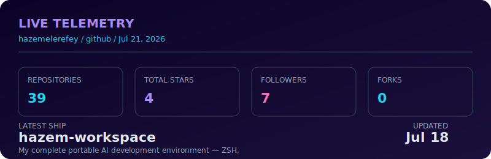

<!--
  ╔����������������������������������������������������������╗
  ║  HAZEM ELEREFY — APPLIED AI & DATA ANALYST                ║
  â•‘  Custom-built profile. Hand-authored SVG + motion system. â•‘
  â•‘  Designed to be read in both dark and light mode.         â•‘
  ╚�����������������������������������������������������������
-->
<a href="https://github.com/hazemelerefey">
  
</a>
<div align="center">
<a href="https://hazemelerefy.vercel.app/">
  
</a>
<a href="https://hazemelerefey.github.io/nebula-profile/">
  
</a>
<a href="https://linkedin.com/in/hazemelerefy">
  
</a>
<a href="mailto:hazemelerefy@gmail.com">
  
</a>
<a href="https://github.com/hazemelerefey/hazemelerefey/blob/main/cv.html">
  
</a>
</div>
<div align="center">
  <picture>
    <source media="(prefers-color-scheme: dark)" srcset="https://readme-typing-svg.demolab.com?font=JetBrains+Mono&weight=600&size=20&pause=900&center=true&vCenter=true&width=900&height=40&color=A78BFA&background=00000000&lines=Applied+AI+%E2%80%A2+Data+Analytics+%E2%80%A2+Decision-Ready+Dashboards;SQL+%E2%80%A2+Python+%E2%80%A2+Power+BI+%E2%80%A2+YOLO+%E2%80%A2+Autonomous+Agents;React+%E2%80%A2+Three.js+%E2%80%A2+GLSL+%E2%80%A2+Motion+Design+%E2%80%A2+Data+Viz">
    <source media="(prefers-color-scheme: light)" srcset="https://readme-typing-svg.demolab.com?font=JetBrains+Mono&weight=600&size=20&pause=900&center=true&vCenter=true&width=900&height=40&color=7C3AED&background=00000000&lines=Applied+AI+%E2%80%A2+Data+Analytics+%E2%80%A2+Decision-Ready+Dashboards;SQL+%E2%80%A2+Python+%E2%80%A2+Power+BI+%E2%80%A2+YOLO+%E2%80%A2+Autonomous+Agents;React+%E2%80%A2+Three.js+%E2%80%A2+GLSL+%E2%80%A2+Motion+Design+%E2%80%A2+Data+Viz">
    
  </picture>
</div>
<p align="center">
  
  
  
</p>


## ◢ /01 · IDENTITY

```ts
const hazem = {
  name:        "Hazem Elerefy",
  role:        "Applied AI & Data Analyst · Frontend-Design Craftsman",
  mainTrack:   "Analytics, BI, predictive modeling, decision-ready dashboards",
  sideTrack:   "Frontend + motion (React, Three.js, Framer Motion, GLSL)",
  aiLayer:     "YOLO, autonomous agents, MCP servers, AI workflow automation",
  superpower:  "Turning numbers into something humans can actually feel.",
  currently:   "Shipping analytics by day. Building AI agents and Nebula for fun.",
} as const;
```

I'm an Applied AI & Data Analyst with a strong visual-engineering side. My core work lives in SQL, Python, Power BI, and predictive modeling, but I also build autonomous AI agents, deep learning systems, and motion-rich frontend experiences. The result: dashboards and tools that don't just report — they communicate.

<table> <tr> <td width="50%" valign="top">

◢ DATA / ANALYTICS · main track
SQL · PostgreSQL · SSMS
Power BI · DAX · Power Query
Python · Pandas · NumPy
Scikit-learn · EDA · forecasting
Executive dashboards · KPI design
Insight-first storytelling

</td> <td width="50%" valign="top">

◢ AI / ML / AUTOMATION · rising track
Deep learning · YOLO · PyTorch
Autonomous agents · n8n
MCP server design & integration
Predictive modeling · SHAP
REST API orchestration
Plugin / skill architecture

</td> </tr> <tr> <td width="50%" valign="top">

◢ FRONTEND / MOTION · craft layer
React · TypeScript · Next.js
Three.js · WebGL · GLSL
Tailwind · Framer Motion
Glassmorphic / holographic UI
Custom data visualization
Motion, depth, easing taste

</td> <td width="50%" valign="top">

◢ BRIDGE SKILLS · differentiator
LL.B. Commercial & Corporate Law
Leadership without authority
Cross-functional communication
Business rules & data governance
Technical-to-stakeholder translation
Self-directed, project-driven learner

</td> </tr> </table>


## ◢ /02 · LIVE TELEMETRY

<p align="center">   </p>

<p align="center">  </p>



## â—¢ ACTIVITY WAVEFORM

<p align="center">  </p>

## ◢ CONTRIBUTION GRID · ANIMATED

<p align="center"> <picture> <source media="(prefers-color-scheme: dark)" srcset="https://raw.githubusercontent.com/hazemelerefey/hazemelerefey/output/github-contribution-grid-snake-dark.svg"/> <source media="(prefers-color-scheme: light)" srcset="https://raw.githubusercontent.com/hazemelerefey/hazemelerefey/output/github-contribution-grid-snake.svg"/>  </picture> </p>


## ◢ /03 · FLAGSHIP SHIPS

<table> <tr> <td width="55%" valign="top"> <a href="https://github.com/hazemelerefey/DigiSteel-YOLO">  </a> </td> <td width="45%" valign="top">

**DigiSteel-YOLO**
Industrial defect detection with custom YOLO

Graduation project from the Applied AI & Data Analytics Diploma. Built a custom YOLO model for steel surface defect detection using the NEU-DET dataset. Added a robustness-testing framework with 24 perturbation scenarios — a step other papers in this space skip.

`PyTorch` · `Ultralytics YOLO` · `Computer Vision` · `Applied AI`

[▶ OPEN REPO](https://github.com/hazemelerefey/DigiSteel-YOLO) · [📄 READ PAPER](https://github.com/hazemelerefey/DigiSteel-YOLO)

</td> </tr> </table>

<table> <tr> <td width="45%" valign="top">

**Nebula 3D**
Real-time cinematic portfolio universe

A living WebGL experience with custom GLSL shaders, glassmorphic HUD, atmospheric particles, and an integrated arcade game. Built to prove an analyst can ship frontend craft that moves.

`Three.js` · `React` · `GLSL` · `WebGL`

[▶ LAUNCH UNIVERSE](https://hazemelerefey.github.io/nebula-profile/) · [REPO](https://github.com/hazemelerefey/nebula-profile)

</td> <td width="55%" valign="top"> <a href="https://hazemelerefey.github.io/nebula-profile/">  </a> </td> </tr> </table>


## ◢ /04 · MORE WORK

| Project | Stack | What it does |
|---------|-------|--------------|
| Social Intelligence Pipeline | n8n · Reddit API · RSS | Autonomous morning agent that pulls, normalizes, and retries trending posts from 5 subreddits without supervision. |
| Social Content AI Agent | n8n · OpenAI · HN · Dev.to | Finds trending stories, scores them, generates Arabic content, and publishes to Facebook & X twice daily. |
| Global E-Commerce Sales Tracker | Power BI · SQL | Executive dashboard tracking revenue, profit, orders, and regional performance with drill-downs. |
| Churn Prediction Model | Python · scikit-learn · SHAP | Predicts retention risk and explains churn drivers with business-ready SHAP interpretation. |
| Real Estate Value Drivers | EDA · Pricing analytics | Structured exploratory analysis turning market noise into comparable value drivers. |
| Healthcare Wait-Time Analytics | SQL · Power BI | Operational analytics for waitlists, specialty demand, and bottleneck visibility. |


## ◢ /05 · PHILOSOPHY

<table> <tr> <td width="33%" valign="top" align="center">

â—‡ CLARITY
A number is only useful if
someone can act on it.

</td> <td width="33%" valign="top" align="center">

â—† CRAFT
The interface is part of
the insight, not decoration.

</td> <td width="33%" valign="top" align="center">

â—ˆ DEPTH
Motion, hierarchy, and layering
keep the signal loud.

</td> </tr> </table>

<p align="center"> <code>clean the data · frame the question · design the answer · ship something rare</code> </p>

<a href="mailto:hazemelerefy@gmail.com"></a>

<div align="center"> <a href="mailto:hazemelerefy@gmail.com">  </a> <a href="https://linkedin.com/in/hazemelerefy">  </a> <a href="https://hazemelerefey.github.io/">  </a>

<sub><i>
This README is hand-built. Every SVG is authored, not templated.
If you can read between the queries, the models, and the shaders — that's the job.
</i></sub>

</div>
